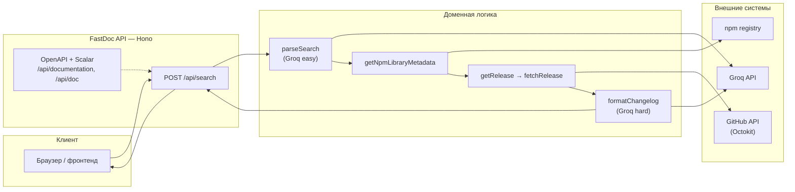
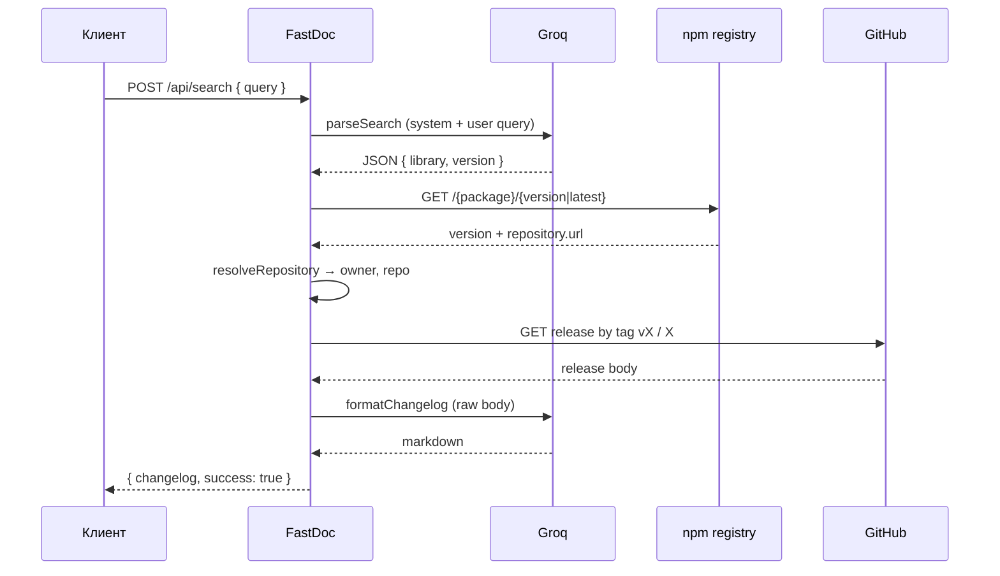

# FastDoc

**FastDoc** — backend-сервис, который по свободному текстовому запросу находит npm-пакет, подтягивает текст релиза с GitHub и возвращает **отформатированный changelog** в Markdown с помощью LLM (Groq).

Ценность: не нужно вручную искать репозиторий, тег релиза и читать сырой текст GitHub Release — достаточно описать запрос на естественном языке (например: «что нового в next 15»).

---

## Содержание

- [Возможности](#возможности)
- [Архитектура](#архитектура)
- [Поток обработки запроса](#поток-обработки-запроса)
- [Технологический стек](#технологический-стек)
- [Структура репозитория](#структура-репозитория)
- [API](#api)
- [Переменные окружения](#переменные-окружения)
- [Локальный запуск](#локальный-запуск)
- [Сборка и продакшен](#сборка-и-продакшен)
- [Тестирование](#тестирование)
- [CI/CD](#cicd)
- [Ограничения и замечания](#ограничения-и-замечания)
- [Связанные репозитории](#связанные-репозитории)

---

## Возможности


| Возможность          | Описание                                                                                                                    |
| -------------------- | --------------------------------------------------------------------------------------------------------------------------- |
| **NL → npm**         | Модель Groq извлекает каноническое имя пакета и версию из текста (с правилами для React, Next, Vue, scoped-пакетов и т.д.). |
| **npm Registry**     | Уточнение версии и получение URL репозитория через официальный registry (`registry.npmjs.org`).                             |
| **GitHub Releases**  | Загрузка тела релиза по API Octokit; попытка тега `v{version}`, затем без префикса `v`.                                     |
| **Форматирование**   | Вторая LLM-стадия приводит changelog к структурированному Markdown и добавляет ссылку на release.                           |
| **OpenAPI + Scalar** | Спецификация и интерактивная документация из коробки.                                                                       |


---

## Архитектура

Логически сервис — тонкий HTTP-слой (Hono) над оркестрацией: **Groq** (парсинг запроса и форматирование) + **npm** (метаданные) + **GitHub** (текст релиза).




**Модели Groq** (см. `src/constants/groq.ts`):

- **easy** — `llama-3.1-8b-instant`: быстрый разбор запроса в JSON с полями библиотеки и версии.
- **hard** — `llama-3.3-70b-versatile`: форматирование длинного текста релиза (до 8000 символов на вход в промпт).

---

## Поток обработки запроса




**Обработка ошибок:** `AppError` и ошибки валидации Zod проходят через `errorHandler`; ошибки Groq маппятся в HTTP-коды (`mapGroqError`).

---

## Технологический стек


| Категория       | Выбор                                                                                                                |
| --------------- | -------------------------------------------------------------------------------------------------------------------- |
| Runtime         | Node.js (ESM, `type: "module"`)                                                                                      |
| HTTP            | [Hono](https://hono.dev/) 4.x                                                                                        |
| OpenAPI         | [@hono/zod-openapi](https://github.com/honojs/middleware/tree/main/packages/zod-openapi) + [Zod](https://zod.dev/) 4 |
| Документация UI | [Scalar](https://scalar.com/) для `/api/doc`                                                                         |
| LLM             | [Groq SDK](https://console.groq.com/)                                                                                |
| GitHub          | [Octokit](https://github.com/octokit/octokit.js)                                                                     |
| Сборка          | [tsup](https://tsup.egoist.dev/) → один ESM-бандл `dist/index.js`                                                    |
| Dev             | `tsx watch`                                                                                                          |
| Тесты           | [Vitest](https://vitest.dev/) 4                                                                                      |
| Качество кода   | ESLint (@antfu/eslint-config), Prettier, `tsc --noEmit`                                                              |


---

## Структура репозитория

```
backend/
├── src/
│   ├── index.ts              # Точка входа: loadEnv, serve(Hono)
│   ├── app.ts                # CORS, логирование, маршруты /api, OpenAPI, Scalar
│   ├── config/               # loadEnv, groqClient, github Octokit
│   ├── constants/groq.ts     # Модели и системные промпты
│   ├── middleware/errorHandler.ts
│   ├── modules/search/       # route, service, zod-схемы
│   ├── services/
│   │   ├── getChangelog.service.ts   # Склейка всего пайплайна
│   │   ├── github/getRelease.service.ts
│   │   ├── npmRegistry/getNpmLibraryMetadata.ts
│   │   └── groq/             # generateAI, parseSearch, formatChangelog, mapError
│   ├── types/INpmLibrary.ts
│   └── utils/                # fetchRelease, resolveRepository, AppError
├── tests/                    # Модульные и интеграционные (endpoint) тесты
├── tsup.config.ts
├── vitest.config.ts
├── tsconfig.json
├── .env.example
└── .gitlab-ci.yml
```

Псевдоним импортов: `@/*` → `src/*`, `@tests/*` → `tests/*`.

---

## API


| Метод и путь             | Описание                                                                                            |
| ------------------------ | --------------------------------------------------------------------------------------------------- |
| `POST /api/search`       | Тело: `{ "query": string }` (минимум 3 символа). Ответ: `{ "changelog": string, "success": true }`. |
| `GET /api/documentation` | OpenAPI 3.0 JSON.                                                                                   |
| `GET /api/doc`           | Scalar UI (тема `alternate`), ссылается на `/api/documentation`.                                    |


**Пример запроса:**

```bash
curl -s -X POST http://localhost:3000/api/search \
  -H "Content-Type: application/json" \
  -d '{"query":"что нового в react 18"}'
```

CORS по умолчанию разрешает origin из `FRONTEND_URL` или `http://localhost:5173`.

---

## Переменные окружения

Скопируйте `.env.example` в `.env` или `.env.development` (оба пути читает `loadEnv`).


| Переменная     | Назначение                                                                                                    |
| -------------- | ------------------------------------------------------------------------------------------------------------- |
| `PORT`         | Порт HTTP-сервера (по умолчанию `3000`).                                                                      |
| `FRONTEND_URL` | Origin для CORS (по умолчанию `http://localhost:5173`).                                                       |
| `GROQ_API_KEY` | Ключ API Groq (**обязателен** для рабочего пайплайна).                                                        |
| `GITHUB_TOKEN` | Токен GitHub для Octokit (рекомендуется: выше лимиты API, доступ к приватным репозиториям при необходимости). |


---

## Локальный запуск

```bash
npm ci
cp .env.example .env
# Заполните GROQ_API_KEY и при необходимости GITHUB_TOKEN

npm run dev
```

Сервер слушает `PORT` (см. выше). Документация: `http://localhost:3000/api/doc`.

---

## Сборка и продакшен

```bash
npm run build    # tsup → dist/
npm run start    # node dist/index.js
```

Убедитесь, что переменные окружения заданы в среде выполнения (контейнер, systemd, PaaS).

---

## Тестирование

```bash
npm run test        # Vitest
npm run type-check  # tsc --noEmit
npm run lint        # ESLint
npm run format      # Prettier
```

Тесты покрывают утилиты (`fetchRelease`, `resolveRepository`), сервисы (changelog, npm, GitHub, Groq-форматирование) и HTTP-слой `POST /api/search` с моками внешних вызовов.

---

## CI/CD

В **GitLab CI** (`.gitlab-ci.yml`) для веток `main`/`develop` и соответствующих MR:

1. **install** — `npm ci`
2. **format** — `format`, `lint`, `type-check`
3. **test** — `npm run test`
4. **build** — артефакт `dist/`

Кэшируются `node_modules/` и связанные пути npm/vite.

---

## Ограничения и замечания

- **Только npm и GitHub:** репозиторий берётся из поля `repository` метаданных пакета; если ссылка не GitHub или отсутствует — разрешение `owner/repo` не сработает.
- **Релиз по тегу:** используется endpoint релизов по тегу (`v{version}` или `{version}`); если релиза с таким тегом нет, получение changelog завершится ошибкой на уровне приложения.
- **Объём текста:** в форматирование передаётся срез changelog до 8000 символов.
- **Отладка:** `fetchRelease` логирует в консоль метрику запроса к GitHub (`[GitHub]` + owner, repo, tag, статус, время).

---

