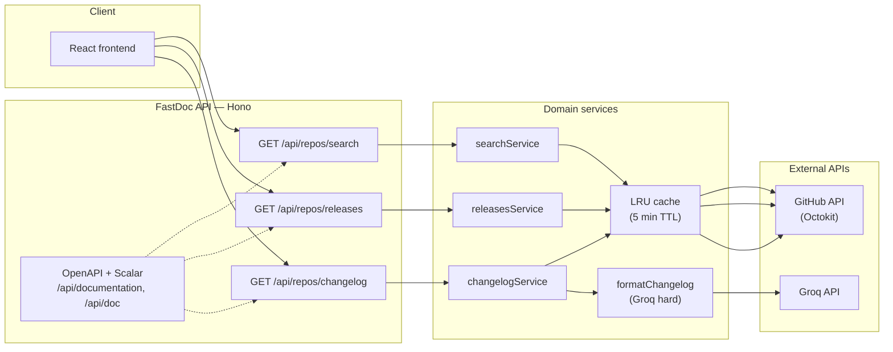
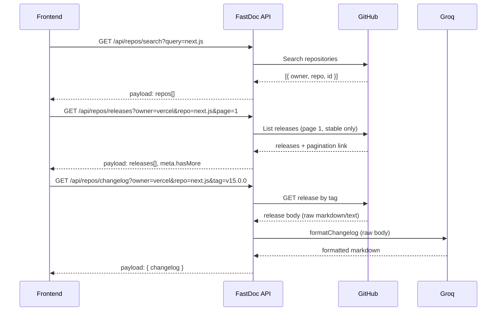

# FastDoc

**FastDoc** is a full-stack application for exploring GitHub release notes. Pick a repository, choose a release tag, and get a clean, structured changelog in Markdown — formatted by an LLM (Groq) from the raw GitHub Release body.

No more digging through long release pages: search for a project like `next.js`, select a version, and read a concise summary in seconds.

This repository contains the **backend API**.

---

## Table of Contents

- [Features](#features)
- [Architecture](#architecture)
- [Request Flow](#request-flow)
- [Tech Stack](#tech-stack)
- [Repository Structure](#repository-structure)
- [API](#api)
- [Environment Variables](#environment-variables)
- [Local Development](#local-development)
- [Build & Production](#build--production)
- [Testing](#testing)
- [CI/CD](#cicd)
- [Limitations](#limitations)
- [Related Repositories](#related-repositories)

---

## Features

| Feature                  | Description                                                                                                             |
| ------------------------ | ----------------------------------------------------------------------------------------------------------------------- |
| **GitHub repo search**   | Find repositories by name via the GitHub Search API (top 15 results, sorted by stars).                                  |
| **Release listing**      | Paginated list of stable (non-prerelease) releases for a selected repository.                                           |
| **Changelog formatting** | Groq LLM turns raw release notes into structured Markdown with headings, bullet points, and a link to the full release. |
| **In-memory caching**    | LRU cache (5-minute TTL) on all service calls to reduce GitHub and Groq API usage.                                      |
| **OpenAPI + Scalar**     | Interactive API documentation at `/api/doc`.                                                                            |
| **Shareable URLs**       | The frontend syncs `repo`, `owner`, and `tag` to the URL query string for deep linking.                                 |

---

## Architecture

The backend is a thin HTTP layer (Hono) over three domain services: **GitHub** (search, releases, release body) and **Groq** (changelog formatting).



**Groq models** (see `src/constants/groq.ts`):

| Alias  | Model                     | Usage                                                              |
| ------ | ------------------------- | ------------------------------------------------------------------ |
| `easy` | `llama-3.1-8b-instant`    | Reserved for lightweight tasks (currently unused in the pipeline). |
| `hard` | `llama-3.3-70b-versatile` | Changelog formatting (input truncated to 8 000 characters).        |

---

## Request Flow

A typical user journey spans three API calls:



**Error handling:** `AppError` instances and Zod validation errors are handled by the global `errorHandler` middleware. Groq SDK errors are mapped to HTTP status codes via `mapGroqError`.

---

## Tech Stack

| Category     | Choice                                                                                                               |
| ------------ | -------------------------------------------------------------------------------------------------------------------- |
| Runtime      | Node.js for local/server builds, Cloudflare Workers for deployment                                                   |
| HTTP         | [Hono](https://hono.dev/) 4.x                                                                                        |
| OpenAPI      | [@hono/zod-openapi](https://github.com/honojs/middleware/tree/main/packages/zod-openapi) + [Zod](https://zod.dev/) 4 |
| API docs UI  | [Scalar](https://scalar.com/) at `/api/doc`                                                                          |
| LLM          | [Groq SDK](https://console.groq.com/)                                                                                |
| GitHub       | [Octokit](https://github.com/octokit/octokit.js)                                                                     |
| Caching      | [lru-cache](https://www.npmjs.com/package/lru-cache)                                                                 |
| Build        | [tsup](https://tsup.egoist.dev/) → single ESM bundle `dist/index.js`                                                 |
| Dev          | `tsx watch`                                                                                                          |
| Tests        | [Vitest](https://vitest.dev/) 4                                                                                      |
| Code quality | ESLint (@antfu/eslint-config), Prettier, `tsc --noEmit`                                                              |

---

## Repository Structure

```
backend/
├── src/
│   ├── index.ts                          # Node entry point: loadEnv, serve(Hono)
│   ├── worker.ts                         # Cloudflare Workers entry point
│   ├── app.ts                            # CORS, logging, /api routes, OpenAPI, Scalar
│   ├── config/
│   │   ├── loadEnv.ts                    # Loads .env.development and .env
│   │   ├── groq.ts                       # Lazy Groq client singleton
│   │   └── githubClient.ts               # Octokit instance
│   ├── constants/groq.ts                 # Model names and formatting prompt
│   ├── middleware/errorHandler.ts
│   ├── modules/repos/
│   │   ├── index.ts                      # Mounts search, releases, changelog routes
│   │   ├── search/                       # GET /api/repos/search
│   │   ├── releases/                     # GET /api/repos/releases
│   │   └── changelog/                    # GET /api/repos/changelog
│   ├── services/
│   │   ├── github/
│   │   │   ├── getRepos.service.ts       # GitHub repository search
│   │   │   ├── getReleases.service.ts    # Paginated release listing
│   │   │   └── getChangelog.service.ts   # Fetch release body by tag
│   │   └── groq/
│   │       ├── generateAIResponse.service.ts
│   │       ├── formatChangelog.service.ts
│   │       └── mapError.service.ts
│   ├── types/                            # IRepos, IReleases, IChangelog
│   └── utils/
│       ├── appError.ts
│       └── cacheClient.ts                # LRU cache wrapper for async functions
├── tests/
│   ├── helpers/                          # expectError, mock factories
│   ├── integration/                      # HTTP endpoint tests
│   ├── services/                         # GitHub & Groq unit tests
│   ├── modules/                          # module service unit tests
│   ├── middleware/
│   └── utils/
├── tsup.config.ts
├── vitest.config.ts
├── tsconfig.json
├── .env.example
├── .dev.vars.example
├── wrangler.jsonc
└── .gitlab-ci.yml
```

Import alias: `@/*` → `src/*`.

---

## API

All endpoints are prefixed with `/api/repos`. Responses follow a consistent envelope:

```json
{
  "payload": <data>,
  "meta": { "success": true, ... }
}
```

Error responses:

```json
{
    "error": "Human-readable message",
    "code": "ERROR_CODE",
    "success": false
}
```

### `GET /api/repos/search`

Search GitHub repositories by name.

| Query param | Type   | Required | Description                    |
| ----------- | ------ | -------- | ------------------------------ |
| `query`     | string | yes      | Search term (min 3 characters) |

**Response `payload`:** array of `{ id, repo, owner }`

```bash
curl -s "http://localhost:3000/api/repos/search?query=next.js"
```

### `GET /api/repos/releases`

List stable releases for a repository (prereleases are filtered out).

| Query param | Type   | Required | Description                                    |
| ----------- | ------ | -------- | ---------------------------------------------- |
| `owner`     | string | yes      | Repository owner                               |
| `repo`      | string | yes      | Repository name                                |
| `page`      | number | no       | Page number (default: 1, 20 releases per page) |

**Response `payload`:** array of `{ id, tag, name }`  
**Response `meta`:** `{ success: true, hasMore: boolean }`

```bash
curl -s "http://localhost:3000/api/repos/releases?owner=vercel&repo=next.js&page=1"
```

### `GET /api/repos/changelog`

Fetch and format the changelog for a specific release tag.

| Query param | Type   | Required | Description                  |
| ----------- | ------ | -------- | ---------------------------- |
| `owner`     | string | yes      | Repository owner             |
| `repo`      | string | yes      | Repository name              |
| `tag`       | string | yes      | Release tag (e.g. `v15.0.0`) |

**Response `payload`:** `{ changelog: string }` (formatted Markdown)

```bash
curl -s "http://localhost:3000/api/repos/changelog?owner=vercel&repo=next.js&tag=v15.0.0"
```

### Documentation endpoints

| Method & path            | Description           |
| ------------------------ | --------------------- |
| `GET /api/documentation` | OpenAPI 3.0 JSON spec |
| `GET /api/doc`           | Scalar interactive UI |

CORS allows the origin from `FRONTEND_URL` (default `http://localhost:5173`).

---

## Environment Variables

Copy `.env.example` to `.env` or `.env.development` (both paths are read by `loadEnv`).

For Cloudflare Workers local development, copy `.dev.vars.example` to `.dev.vars`.

| Variable       | Description                                                           |
| -------------- | --------------------------------------------------------------------- |
| `PORT`         | HTTP server port (default: `3000`)                                    |
| `FRONTEND_URL` | Allowed CORS origin (default: `http://localhost:5173`)                |
| `GROQ_API_KEY` | Groq API key (**required** for changelog formatting)                  |
| `GITHUB_TOKEN` | GitHub personal access token (recommended for higher API rate limits) |

---

## Local Development

### Backend

```bash
npm ci
cp .env.example .env
# Fill in GROQ_API_KEY and optionally GITHUB_TOKEN

npm run dev
```

The server listens on `PORT`. API docs: `http://localhost:3000/api/doc`.

Cloudflare Workers runtime:

```bash
cp .dev.vars.example .dev.vars
npm run dev:worker
```

### Frontend (companion app)

```bash
cd ../frontend
npm ci
cp .env.example .env
# Set VITE_API_URL=http://localhost:3000/api

npm run dev
```

The UI runs at `http://localhost:5173` by default.

---

## Build & Production

```bash
npm run build    # tsup → dist/
npm run start    # node dist/index.js
```

Ensure environment variables are set in the runtime environment (container, PaaS, etc.).

Cloudflare Workers deploy:

```bash
npm run deploy:staging
npm run deploy
```

Set `GROQ_API_KEY` and `GITHUB_TOKEN` as Cloudflare Worker secrets, not plain vars:

```bash
npx wrangler secret put GROQ_API_KEY --env production
npx wrangler secret put GITHUB_TOKEN --env production
npx wrangler secret put GROQ_API_KEY --env staging
npx wrangler secret put GITHUB_TOKEN --env staging
```

Update `FRONTEND_URL` in `wrangler.jsonc` for staging and production before deploying.

---

## Testing

```bash
npm run test        # Vitest (single run)
npm run test:watch  # Vitest watch mode
npm run type-check  # tsc --noEmit
npm run lint        # ESLint
npm run format      # Prettier
```

The test suite uses **Vitest** with mocked GitHub (Octokit) and Groq clients — no real API calls or secrets required.

All tests live under `tests/`, mirroring the `src/` layout:

```
tests/
├── helpers/          # shared utilities and mock factories
├── integration/      # HTTP endpoint tests
├── services/         # GitHub & Groq service tests
├── modules/          # module service tests
├── middleware/
└── utils/
```

| Level           | Location                                                                 | What is covered                                                                             |
| --------------- | ------------------------------------------------------------------------ | ------------------------------------------------------------------------------------------- |
| **Unit**        | `tests/services/`, `tests/modules/`, `tests/utils/`, `tests/middleware/` | GitHub/Groq services, module services, `cacheClient`, `errorHandler`                        |
| **Integration** | `tests/integration/`                                                     | HTTP endpoints via Hono `app.request()` — validation, response envelopes, error propagation |

Shared helpers live in [`tests/helpers/testHelper.ts`](tests/helpers/testHelper.ts) (`expectError`, mock factories).

---

## CI/CD

**GitLab CI** (`.gitlab-ci.yml`) runs on `main`/`develop` branches and their merge requests:

1. **install** — `npm ci`
2. **format** — `format`, `lint`, `type-check`
3. **test** — `npm run test`
4. **build** — artifact `dist/`
5. **deploy** — `develop` deploys to Cloudflare staging, `main` deploys to Cloudflare production

`node_modules/` and npm cache paths are cached between jobs.

Required GitLab CI/CD variables:

| Variable                | Description                             |
| ----------------------- | --------------------------------------- |
| `CLOUDFLARE_ACCOUNT_ID` | Cloudflare account ID                   |
| `CLOUDFLARE_API_TOKEN`  | API token with Workers edit permissions |

Required Cloudflare Worker secrets:

| Secret         | Description                      |
| -------------- | -------------------------------- |
| `GROQ_API_KEY` | Groq API key                     |
| `GITHUB_TOKEN` | GitHub token for higher API rate |

---

## Limitations

- **GitHub only:** repository search and release data come exclusively from the GitHub API. There is no npm registry integration or natural-language query parsing.
- **Stable releases only:** prereleases are excluded from the release list.
- **Exact tag required:** the changelog endpoint fetches a release by tag name via `GET /repos/{owner}/{repo}/releases/tags/{tag}`. If the tag does not exist, the request fails with a 404.
- **Input size cap:** raw release body is truncated to 8 000 characters before being sent to Groq.
- **In-memory cache:** cache is per-process and resets on restart. Not suitable for multi-instance deployments without a shared cache layer.
- **GitHub rate limits:** unauthenticated requests are limited to 60 requests/hour. A `GITHUB_TOKEN` raises the limit to 5 000 requests/hour.

---

## Related Repositories

| Repository              | Role                                                             |
| ----------------------- | ---------------------------------------------------------------- |
| **backend** (this repo) | Hono API: GitHub proxy + Groq changelog formatting               |
| **frontend**            | React + Vite UI: repo search, release picker, Markdown rendering |

The frontend communicates with the backend via `VITE_API_URL` and stores the selected `repo`, `owner`, and `tag` in the browser URL for shareable links.
